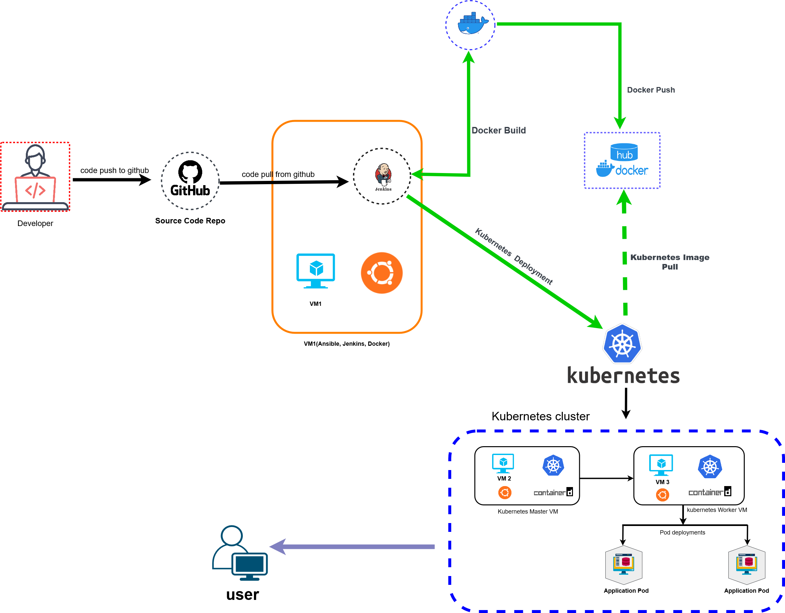
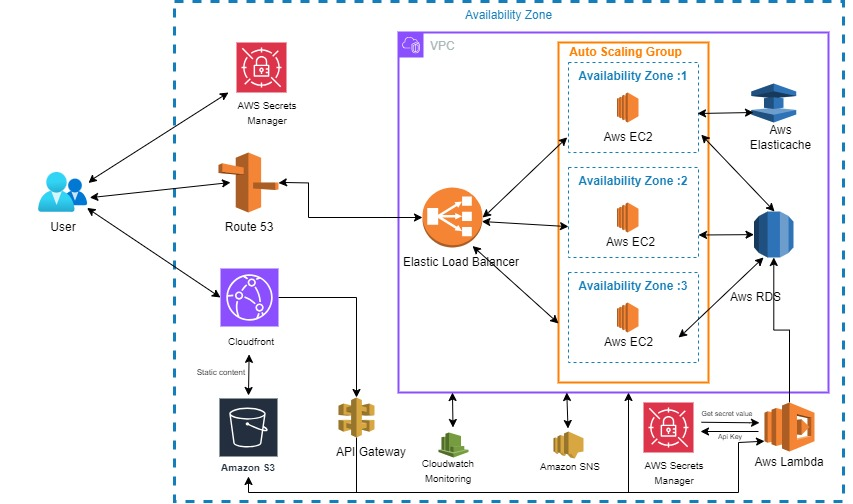

# DevOps Task

---

This project encompasses the development, containerization, and deployment of a PHP-based REST API integrated with weather data retrieval from OpenWeather API. The system is designed to provide basic information such as hostname, datetime, and version, along with weather data for a specified location (in this case, Dhaka). The project utilizes Docker for containerization and Kubernetes for deployment.
### Task 1 : Architecture diagram

1. **PHP REST API**: 
   - Developed using PHP with GuzzleHttp for API requests.
   - Implements endpoints for basic information retrieval and weather data.

2. **Docker Containerization**:
   - Utilizes Docker for containerization of the PHP application.
   - Dockerfile includes installation of necessary PHP extensions, Composer for dependency management, and configuration of Apache web server.

3. **Kubernetes Deployment**:
   - Kubernetes deployment includes YAML files for ConfigMap, Deployment, and Service.
   - The ConfigMap is used to store sensitive data such as API keys.
   - Deployment ensures the availability and scaling of the PHP application.
   - Service exposes the application externally, enabling access from outside the cluster.

4. **Pipeline Automation**:
   - Jenkins Pipeline script automates the build, push, and deployment processes.
   - Includes Git clone, Docker image build and push, Kubernetes deployment, and Slack notifications for build status.

## Workflow Overview:

1. **Development**: PHP code developed to create REST API endpoints and integrate with OpenWeather API.
2. **Containerization**: PHP application containerized using Docker, ensuring consistency across environments.
3. **Deployment**: Kubernetes utilized for deploying and managing the application in a scalable and resilient manner.
4. **Automation**: Jenkins Pipeline automates the entire CI/CD process, from code integration to deployment, ensuring efficiency and reliability.
5. **Monitoring and Alerts**: Continuous monitoring of the application health and performance, with alerts configured for any anomalies.

### Task 2 : Architecture diagram

## AWS Services:
1. **AWS Lambda**: A serverless compute service that allows running code without managing servers. It's ideal for backend APIs as it automatically scales with incoming requests.

2. **Amazon RDS**: A managed PostgreSQL database service that handles administrative tasks like backups, patching, and scaling. It provides a reliable and scalable database solution for your application.

3. **AWS Secrets Manager**: Securely stores and manages sensitive information such as API keys, passwords, and database credentials. It ensures that your secrets are encrypted and accessed securely by your applications.

4. **Amazon S3**: An object storage service for storing and retrieving static assets like images, videos, and files. It provides high durability, scalability, and low latency access to data.

5. **Amazon CloudFront**: A content delivery network (CDN) that accelerates the delivery of your web content globally by caching data at edge locations closer to end-users. It improves performance and reduces latency for accessing static assets.

6. **Amazon CloudWatch**: A monitoring and logging service that provides insights into your AWS resources' operational health and performance. It enables you to set up alarms, monitor metrics, and gain visibility into resource utilization.

7. **Load Balancer**: Distributes incoming application or network traffic across multiple targets, ensuring high availability and reliability of your applications.

8. **Route 53**: A scalable domain name system (DNS) web service designed to route end-users to internet applications by translating domain names into numeric IP addresses.

9. **Amazon SNS**: A fully managed pub/sub messaging service for coordinating the delivery of messages to subscribing endpoints or clients. It allows you to send notifications or messages to a large number of recipients asynchronously.
    
10. **Amazon CloudFront**:
A content delivery network (CDN) that distributes content globally, improving performance by caching data closer to end-users. Accelerates delivery of web content and reduces latency.

