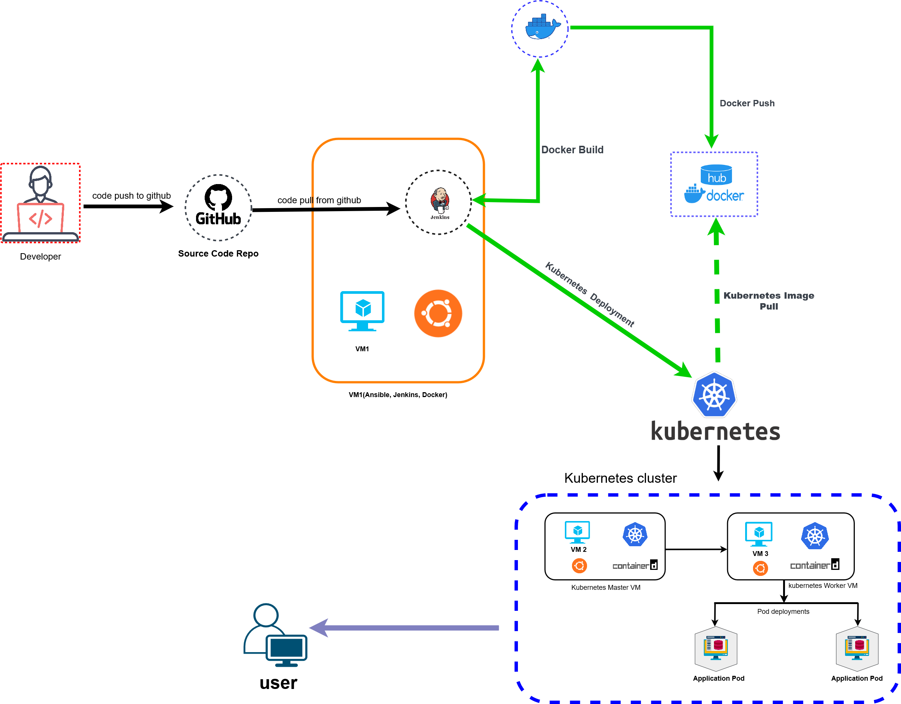

# Project Summary

---

This project encompasses the development, containerization, and deployment of a PHP-based REST API integrated with weather data retrieval from OpenWeather API. The system is designed to provide basic information such as hostname, datetime, and version, along with weather data for a specified location (in this case, Dhaka). The project utilizes Docker for containerization and Kubernetes for deployment.
### Architecture diagram

## Key Components:

1. **PHP REST API**: 
   - Developed using PHP with GuzzleHttp for API requests.
   - Implements endpoints for basic information retrieval and weather data.

2. **Docker Containerization**:
   - Utilizes Docker for containerization of the PHP application.
   - Dockerfile includes installation of necessary PHP extensions, Composer for dependency management, and configuration of Apache web server.

3. **Kubernetes Deployment**:
   - Kubernetes deployment includes YAML files for ConfigMap, Deployment, and Service.
   - The ConfigMap is used to store sensitive data such as API keys.
   - Deployment ensures the availability and scaling of the PHP application.
   - Service exposes the application externally, enabling access from outside the cluster.

4. **Pipeline Automation**:
   - Jenkins Pipeline script automates the build, push, and deployment processes.
   - Includes Git clone, Docker image build and push, Kubernetes deployment, and Slack notifications for build status.

## Workflow Overview:

1. **Development**: PHP code developed to create REST API endpoints and integrate with OpenWeather API.
2. **Containerization**: PHP application containerized using Docker, ensuring consistency across environments.
3. **Deployment**: Kubernetes utilized for deploying and managing the application in a scalable and resilient manner.
4. **Automation**: Jenkins Pipeline automates the entire CI/CD process, from code integration to deployment, ensuring efficiency and reliability.
5. **Monitoring and Alerts**: Continuous monitoring of the application health and performance, with alerts configured for any anomalies.

